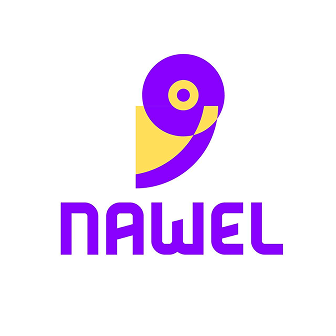

# 📱 AUVNET Flutter Internship Assessment

A well-structured Flutter application built for the AUVNET internship assessment, demonstrating a complete authentication flow, onboarding experience, and home interface with clean architecture and Bloc state management.

---

## 🚀 Getting Started

This app delivers a smooth user experience from the splash screen to authenticated usage. Built with maintainability and scalability in mind using the **Bloc pattern** and **Clean Architecture** principles.

---

## ✨ Features

- ⏳ **Splash Screen**: Displays for 5 seconds upon app launch.
- 👣 **Onboarding Flow**:
    - 3 informative onboarding pages.
    - Users can swipe through or tap **Next**.
    - **Get Started** navigates to the login screen.
- 🔐 **Authentication**:
    - Integrated with **Firebase Authentication**.
    - **Sign Up**: User provides full name, email, and password.
        - The full name is stored and used later to personalize the user experience.
    - **Login**: Existing users can log in using email and password.
    - High accuracy and stability ensured through proper error handling.
- 🏠 **Home Screen**:
    - Personalized greeting: "Hi, [User Name]".
    - Professionally crafted UI layout with clean design.
- 🗃️ **Firestore Storage**:
    - Upon signup, the user is added to the **`users`** collection in Firestore.
    - The app supports structured user data storage for future use.

---

## 🧱 Architecture

- ✅ Clean Architecture structure
- ✅ Bloc State Management
- ✅ Dependency Injection via `getIt`
- ✅ Local data persistence using `Hive`
- ✅ Shared Preferences for lightweight caching

---

## 📸 Screenshots

```md



